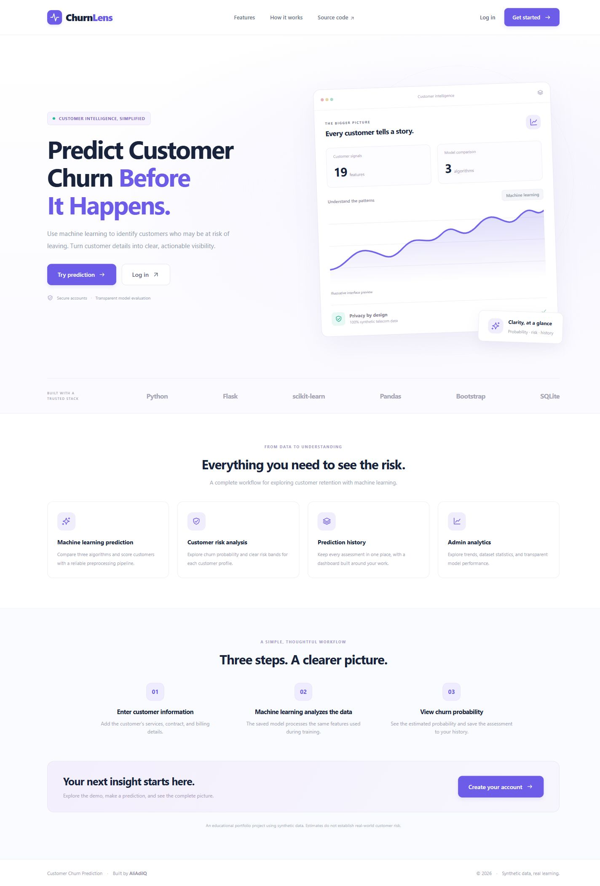
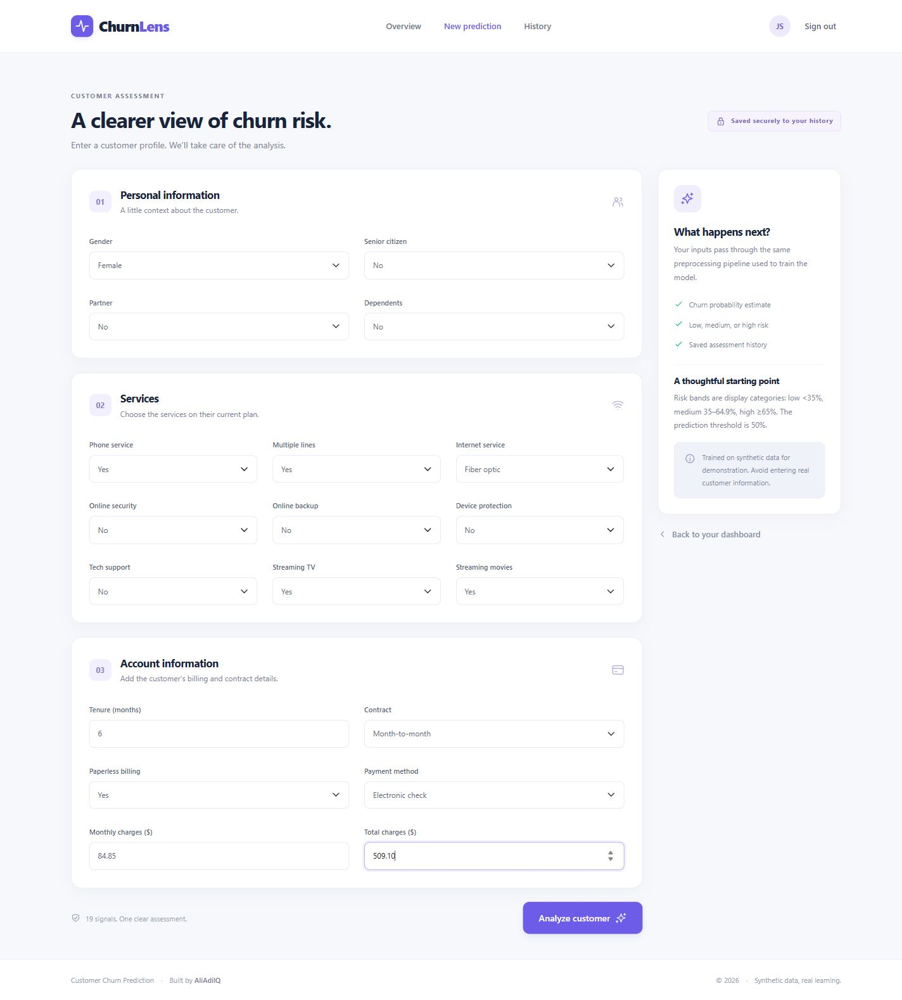
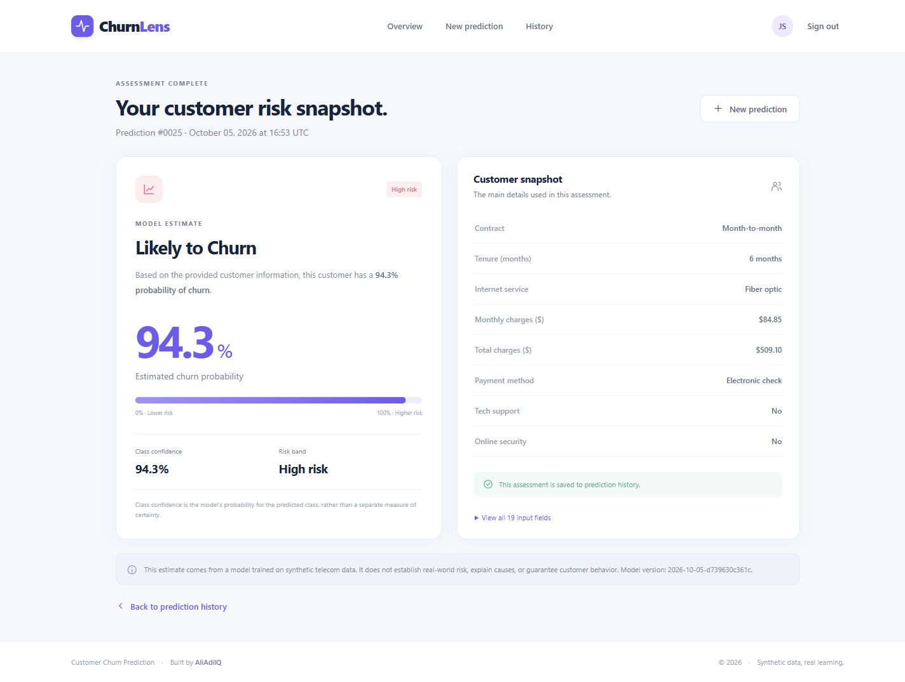
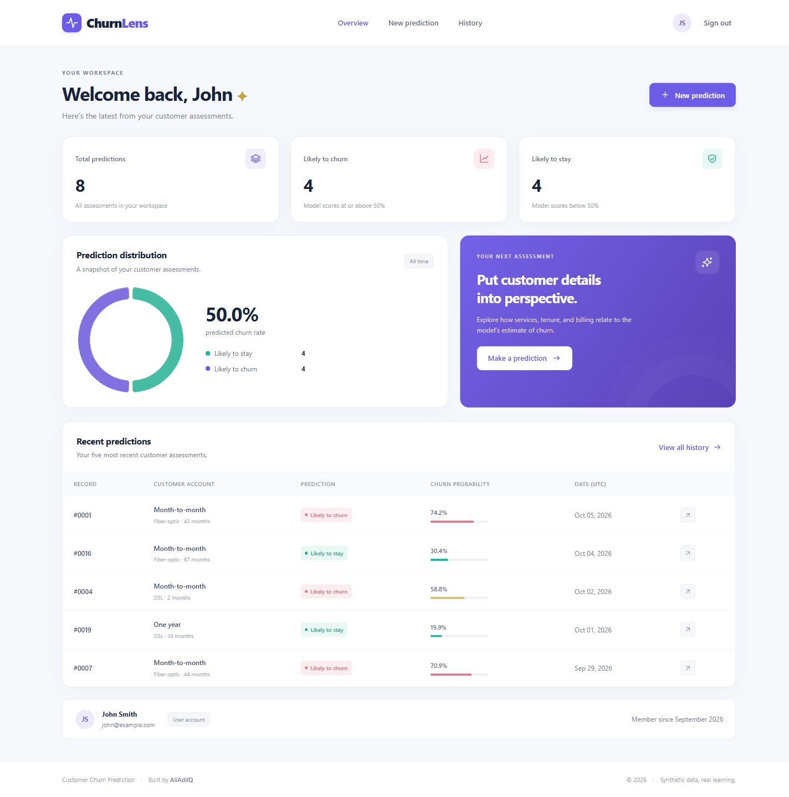
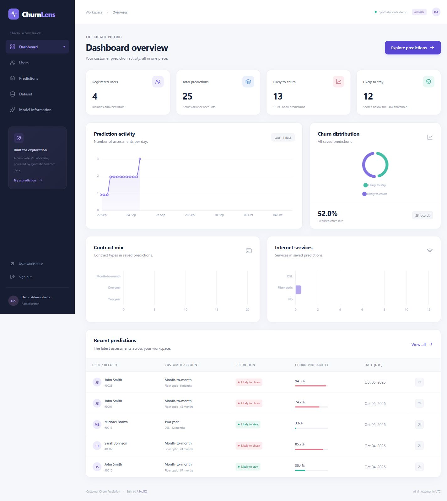
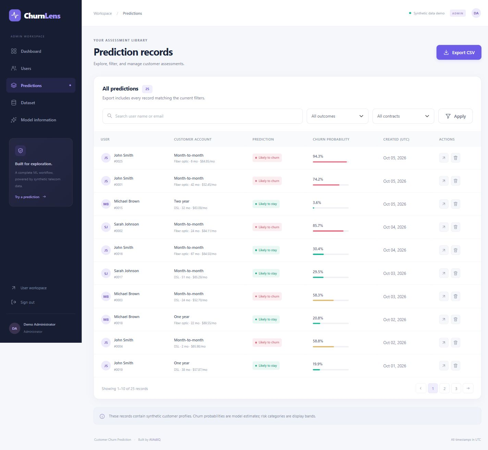
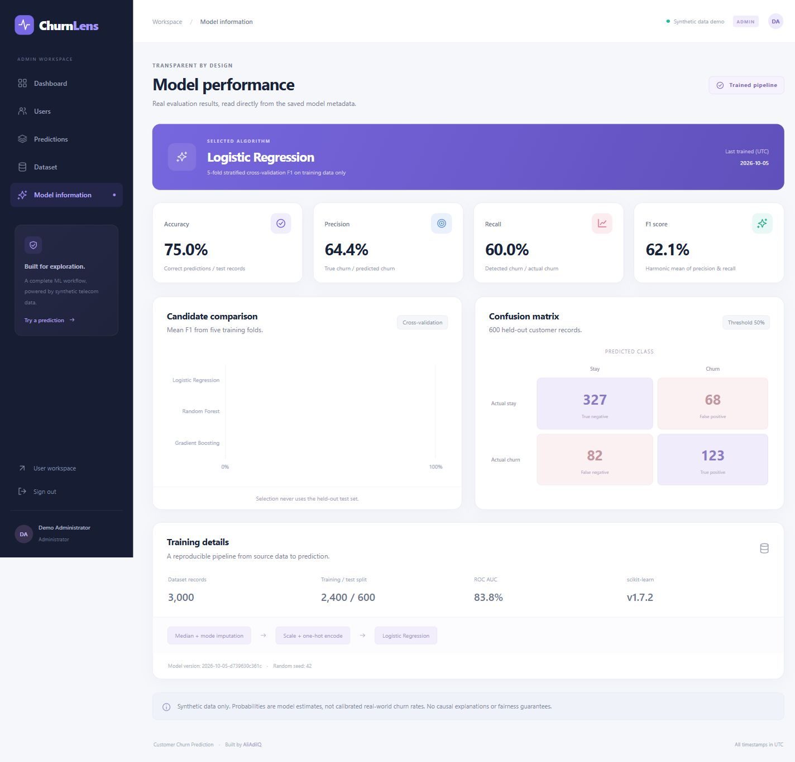

# Customer Churn Prediction

[](https://www.python.org/)
[](https://flask.palletsprojects.com/)
[](https://scikit-learn.org/)
[](LICENSE)
[](https://github.com/AliAdilQ/customer_churn_prediction)

A complete Flask and scikit-learn application for exploring customer churn. **ChurnLens**, its responsive web interface, brings together customer assessments, private prediction history, and an administrator workspace with transparent model evaluation.

Built by [AliAdilQ](https://github.com/AliAdilQ). Repository: [customer_churn_prediction](https://github.com/AliAdilQ/customer_churn_prediction).

## Overview

Customer churn prediction helps teams investigate patterns associated with customers leaving a service. This project demonstrates the complete workflow: generating coherent telecom data, comparing models, persisting a preprocessing pipeline, authenticating users, scoring profiles, and exploring the resulting records.

The dataset is **synthetic**. This is a portfolio and educational application, not a validated system for decisions about real customers. Scores show model estimates and do not establish causal explanations or real-world retention outcomes.

## Features

- Machine learning churn predictions from 19 customer features, with estimated probability, class confidence, and risk bands.
- Registration, login, POST logout, hashed passwords, Flask-Login sessions, and CSRF-protected forms.
- User dashboard with personal counts, a distribution chart, account details, and recent assessments.
- Private prediction history with outcome filtering, pagination, and full assessment details.
- Dedicated admin dashboard with counts, predicted churn rate, activity trends, contract mix, and internet service charts.
- Searchable user directory and prediction records, contract/outcome filters, pagination, filtered CSV export, and protected deletion with confirmation.
- Dataset exploration with real statistics, label charts, missing-value counts, and a preview.
- Model information from saved metadata: candidate comparison, measured metrics, confusion matrix, training sizes, and model version.
- Responsive Bootstrap interface, accessible labels, keyboard focus, loading states, flash messages, empty states, and custom 403/404/500 pages.
- Locally bundled Bootstrap and Chart.js: the application interface does not require a CDN connection.

## Screenshots

Actual screenshots of the running application with seeded synthetic data. These are captured at a desktop viewport; the UI also adapts to smaller screens.

### Home page



### Customer prediction form



### Prediction result



### User dashboard



### Admin dashboard



### Admin prediction records



### Model performance



## Technology Stack

| Layer | Technologies | Purpose |
| --- | --- | --- |
| Frontend | HTML5, CSS3, Bootstrap 5, JavaScript, Chart.js | Responsive forms, workspaces, and analytics |
| Backend | Python, Flask, Flask-SQLAlchemy, Flask-Login | Application factory, database access, sessions, and authorization |
| Security | Werkzeug, Flask-WTF | Password hashing and CSRF protection |
| Machine learning | Pandas, NumPy, scikit-learn, Joblib | Data preparation, model comparison, and pipeline persistence |
| Database | SQLite | Simple local persistence |
| Configuration | python-dotenv | Environment-based settings |
| Testing | pytest | Isolated integration, security, and model checks |
| Serving | Waitress | Optional production WSGI server on Windows or Linux |

## Machine Learning Workflow

1. **Dataset preparation:** `generate_data.py` creates 3,000 reproducible telecom records with seed 42. Service add-ons match phone/internet availability; charges reflect subscribed services and tenure. Churn is sampled from a noisy probability rule based on account relationships.
2. **Cleaning:** remove duplicate records and invalid targets, coerce numerical columns, normalize empty values, and replace unsupported categories with missing values. About 1% of each billing column is deliberately missing.
3. **Preprocessing:** a `ColumnTransformer` fits median imputation and standard scaling for numeric features, plus most-frequent imputation and one-hot encoding for categorical features. Unknown categories are handled safely by the pipeline.
4. **Train/test split:** use a stratified, reproducible 80/20 split. Hold out the test set before selecting any model.
5. **Model comparison:** compare Logistic Regression, Random Forest, and Gradient Boosting using five-fold stratified cross-validation on **training data only**. Each fold fits its own preprocessing, preventing preprocessing leakage.
6. **Best model selection and evaluation:** select the highest mean cross-validation F1, fit it to the training set, then evaluate once on the untouched test set. Report accuracy, precision, recall, F1, ROC AUC, the classification report, and a confusion matrix.
7. **Prediction pipeline:** persist the entire fitted pipeline to `models/churn_model.joblib`. The web service supplies a named DataFrame in the same feature order. A 50% churn probability threshold determines the predicted class.

The independently saved `preprocessor.joblib` is available for inspection; web predictions use the complete pipeline. Candidate scores are cross-validation results; the final scores below are test results. The saved model is not refitted to include the holdout.

## Project Structure

```text
customer_churn_prediction/
├── app/
│   ├── __init__.py             # Application factory, extensions, error handling
│   ├── cli.py                  # init-db and create-admin commands
│   ├── extensions.py           # SQLAlchemy, LoginManager, CSRF
│   ├── models.py               # User and Prediction relationships
│   ├── routes/
│   │   ├── main.py             # Landing page and user dashboard
│   │   ├── auth.py             # Registration, login, logout
│   │   ├── prediction.py       # Validation, assessment, personal history
│   │   └── admin.py            # Analytics, management, export
│   ├── services/
│   │   ├── analytics.py        # Shared dashboard aggregations
│   │   ├── ml_service.py       # Trusted pipeline loading and inference
│   │   └── schema.py           # Feature definitions and input validation
│   ├── templates/              # Reusable layouts, user/admin/error pages
│   └── static/
│       ├── css/                # Shared and admin design systems
│       ├── js/                 # Forms, charts, mobile navigation
│       ├── images/             # Local SVG icon sprite and favicon
│       └── vendor/             # Pinned Bootstrap, Chart.js, and licenses
├── data/customer_churn.csv
├── models/
│   ├── churn_model.joblib
│   ├── preprocessor.joblib
│   ├── model_metrics.json
│   └── confusion_matrix.csv
├── docs/
│   ├── screenshots/            # Real screenshots of the application
│   ├── architecture.md
│   └── verification.md          # Recorded checks and browser validation
├── scripts/download_assets.py
├── tests/                      # Temporary database, real pipeline, CSRF tests
├── instance/.gitkeep           # Local SQLite file is created here, ignored
├── .github/workflows/tests.yml
├── generate_data.py
├── train_model.py
├── seed.py
├── run.py
├── config.py
├── requirements.txt
├── pytest.ini
├── .env.example
├── .gitignore
├── LICENSE
├── CONTRIBUTING.md
└── README.md
```

Prediction inputs are stored as a JSON object containing all 19 named customer fields, alongside a user foreign key, outcome, probability, model version, and UTC timestamp. This keeps database storage aligned with the shared feature schema.

## Installation

Prerequisites: **Python 3.11 or 3.12**, Git, and an internet connection for the initial package installation. The trained model and frontend assets are included, so retraining and downloading frontend assets are optional.

```bash
git clone https://github.com/AliAdilQ/customer_churn_prediction.git
cd customer_churn_prediction
python -m venv venv
```

Windows (Command Prompt):

```bat
venv\Scripts\activate
```

Windows (PowerShell):

```powershell
.\venv\Scripts\Activate.ps1
```

If your PowerShell policy prevents activation, use `venv\Scripts\python.exe` in place of `python` and `venv\Scripts\python.exe -m pip` in place of `pip`. Activation is optional.

macOS/Linux:

```bash
source venv/bin/activate
```

Install the dependencies:

```bash
pip install -r requirements.txt
```

Use the pinned dependency versions when loading the included Joblib artifacts. Scikit-learn model persistence does not guarantee compatibility across library versions; retrain after upgrading dependencies.

## Environment Setup

Copy `.env.example` to `.env`.

Windows:

```powershell
Copy-Item .env.example .env
```

macOS/Linux:

```bash
cp .env.example .env
```

For local exploration, no edits are required: the example secret is replaced by a random in-memory development key. That key changes on restart and invalidates existing sessions. To retain sessions, set `SECRET_KEY` to a private random value, which you can generate with:

```bash
python -c "import secrets; print(secrets.token_hex(32))"
```

| Variable | Default / example | Behavior |
| --- | --- | --- |
| `APP_ENV` | `development` | Use `production` to require a configured secret and secure cookies |
| `SECRET_KEY` | Development-generated random key | Production requires a private value of at least 32 characters |
| `DATABASE_URL` | `sqlite:///customer_churn.db` | Relative SQLite paths resolve under `instance/` |
| `FLASK_APP` | `run.py` | Flask CLI entry point |
| `FLASK_DEBUG` | `0` | Debug mode is opt-in and disabled in production |
| `HOST` / `PORT` | `127.0.0.1` / `5000` | Local development binding |

`FLASK_ENV` is included for familiarity with older setups; current Flask uses `APP_ENV` here and `FLASK_DEBUG` for its debugger.

## Generate Dataset

The sample dataset is included. To reproduce it:

```bash
python generate_data.py
```

Optional parameters: `--samples 3000 --seed 42 --output data/customer_churn.csv`. At least 1,000 records are required. Changing the dataset requires retraining to align it with the saved model.

## Train Model

```bash
python train_model.py
```

Training prints candidate cross-validation results and the selected model’s test metrics. It saves the pipeline, preprocessing artifact, metadata, and confusion matrix. It also updates the marked **Model Performance** section of this README directly from the actual results, preventing stale or invented metrics. Restart the web server after retraining because it caches the loaded model per application.

## Initialize Database

```bash
python seed.py
```

This creates tables, one administrator, three normal users, and 24 model-scored sample predictions spread over recent dates. Rerunning it preserves existing accounts, passwords, and records. Sample predictions are added only when the prediction table is empty. It does not elevate an existing account with a different role. Demo seeding is disabled when `APP_ENV=production`.

## Run Application

```bash
python run.py
```

Open [http://127.0.0.1:5000](http://127.0.0.1:5000). Register a new account or use a seeded demo account. The default local server has debugging disabled.

For a quick start using the included dataset and model, only installation, environment setup, `python seed.py`, and `python run.py` are required.

For a production deployment, use a dedicated WSGI server and HTTPS rather than Flask’s development server. After setting a private `SECRET_KEY` and `APP_ENV=production`, initialize a fresh database and create your own administrator:

```bash
flask --app run init-db
flask --app run create-admin
waitress-serve --listen=127.0.0.1:8000 run:app
```

Put an HTTPS reverse proxy in front of Waitress; production cookies require HTTPS. Do not expose a database containing demo accounts. Additional operational controls, such as rate limiting, backups, monitoring, and a migration workflow, are deployment responsibilities. See [Flask deployment guidance](https://flask.palletsprojects.com/en/stable/deploying/).

## Demo Credentials

### Administrator

| Name | Email | Password |
| --- | --- | --- |
| Demo Administrator | `admin@example.com` | `Admin@12345` |

### Demo Users

| Name | Email | Password |
| --- | --- | --- |
| John Smith | `john@example.com` | `User@12345` |
| Sarah Johnson | `sarah@example.com` | `User@12345` |
| Michael Brown | `michael@example.com` | `User@12345` |

> These credentials are included only for local demonstration purposes. Change or remove them before production deployment.

## Admin Panel

Log in with the demo administrator to open `/admin` automatically, or select **Admin panel** from the main navigation.

| Route | Function |
| --- | --- |
| `/admin` | User/prediction counts, predicted churn percentage, charts, recent records |
| `/admin/users` | Searchable account directory with roles and registration dates |
| `/admin/predictions` | Search, outcome/contract filters, pagination, detail view, deletion |
| `/admin/predictions/export` | CSV of all matching records, with spreadsheet-formula neutralization |
| `/admin/dataset` | Actual dataset statistics, target distributions, preview |
| `/admin/model` | Saved algorithm, cross-validation results, test metrics, confusion matrix |

All admin routes check both authentication and role. Delete actions require a POST, a valid CSRF token, and a browser confirmation. Users can only view their own histories and assessment details; administrators can view all records. Dates are presented in UTC.

## Model Performance

<!-- MODEL_METRICS_START -->
Selected algorithm: **Logistic Regression**. Training: **2,400** rows; held-out test: **600** rows.

| Test metric | Value |
| --- | ---: |
| Accuracy | 75.00% |
| Precision | 64.40% |
| Recall | 60.00% |
| F1 | 62.12% |
| Roc Auc | 83.77% |

Generated from `models/model_metrics.json`. Trained on 2026-10-05 (UTC).

<!-- MODEL_METRICS_END -->

Precision, recall, and F1 refer to the **churn** class. The confusion matrix uses `[Stay, Churn]` for both axes. Model selection uses training-fold F1, while the reported metrics measure a separate holdout. See [scikit-learn model selection documentation](https://scikit-learn.org/stable/model_selection.html).

Risk bands are UI conventions: **low** below 35%, **medium** from 35% to below 65%, **high** at or above 65%. The predicted class changes at 50%, so a medium-risk customer can be labeled either stay or churn. Class confidence is the probability of the predicted class (`p` for churn, `1-p` for stay), not an independent confidence guarantee. Probabilities have not been calibrated or validated on real telecom data.

## Dataset

`data/customer_churn.csv` contains 3,000 synthetic telecom customer records and 20 columns: 19 input features plus the `churn` target (`Yes` / `No`). It was generated specifically for demonstration and educational purposes and contains **no real customer personal information**.

| Group | Features |
| --- | --- |
| Personal | gender, senior_citizen, partner, dependents |
| Services | phone_service, multiple_lines, internet_service, online_security, online_backup, device_protection, tech_support, streaming_tv, streaming_movies |
| Account | tenure, contract, paperless_billing, payment_method, monthly_charges, total_charges |

The generator models higher churn odds for short tenure, month-to-month contracts, and some service/billing combinations, with stochastic noise to avoid perfect or deterministic classification. Gender and senior status are not direct terms in the synthetic churn rule, but this does not establish model fairness. Small missing-value samples exercise the preprocessing pipeline. Dataset-label statistics and saved-prediction statistics measure different things and are shown separately.

## Tests

```bash
pytest
```

The suite uses a temporary SQLite database for every test, leaving the development database untouched. It covers registration/password hashing, duplicate and invalid inputs, login, safe redirects, CSRF, protected routes, real model inference and storage, service consistency, user isolation, admin access, POST deletion, filtered/formula-safe CSV export, static assets, reproducible data, and metadata/holdout agreement. GitHub Actions runs the suite on Python 3.11 and 3.12.

## Future Improvements

- A versioned REST API and batch scoring.
- Docker packaging, managed PostgreSQL, database migrations, and cloud deployment.
- Probability calibration and external validation on properly governed real data.
- Advanced models, SHAP explanations, and fairness evaluation.
- Opt-in email alerts and operational monitoring for drift and performance.
- Rate limiting, account recovery, and richer audit logs.

## Security Note

Passwords are hashed using Werkzeug security utilities; the database never stores plaintext passwords. Registration always assigns the normal user role. SQLAlchemy handles database statements, Jinja autoescapes output, forms validate numeric bounds/category values/service dependencies, and state-changing requests require CSRF tokens. Sessions use HttpOnly and SameSite cookies; production also enables Secure cookies and rejects an absent or example secret.

Keep private configuration in `.env`, which is ignored by Git. Local databases, caches, logs, and virtual environments are also ignored. The public demo credentials belong only in local demonstration environments. Joblib can execute code while loading: only load trusted artifacts from this repository or ones you trained yourself. This app does not offer model uploads.

## Author

### AliAdilQ

- GitHub: [https://github.com/AliAdilQ](https://github.com/AliAdilQ)
- Repository: [https://github.com/AliAdilQ/customer_churn_prediction](https://github.com/AliAdilQ/customer_churn_prediction)

## License

Licensed under the [MIT License](LICENSE), copyright © 2026 AliAdilQ. Bundled Bootstrap and Chart.js retain their own MIT license files under `app/static/vendor/`.
