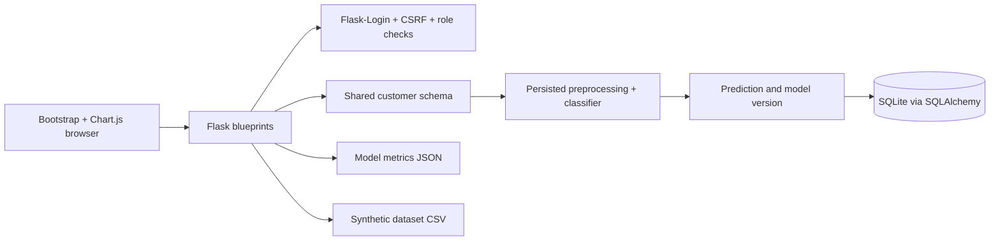

# Architecture and design decisions

The Flask factory creates an independent application, binds extensions, registers blueprints, and applies configuration. Tests instantiate it with a temporary database. User-facing routes and the admin blueprint share service logic and presentation macros.

## Model lifecycle

`generate_data.py` writes deterministic feature data and probabilistic labels. Training reserves a stratified holdout, compares three complete pipelines using training-fold F1, and persists the winner fitted to training data. The web service loads this trusted pipeline once per app instance. Restart after replacing artifacts. Every prediction stores the original customer fields, exact probability, outcome, and model version so past results remain meaningful after retraining.

`preprocessor.joblib` duplicates the fitted preprocessing stage for inspection; inference always uses the complete pipeline. `model_metrics.json` supplies the admin evaluation page and README metrics. `confusion_matrix.csv` supports independent review. Do not upload or load untrusted pickle/Joblib files.

## Data ownership

Prediction history queries constrain records by the logged-in user's ID. A detail view returns 404 for another user's record. The admin decorator checks both authentication and the persisted account role. Public registration ignores submitted roles and sets `user`. User-to-prediction relationships use foreign keys and SQLAlchemy, and the customer JSON object keeps all feature names together.

All timestamps are stored and displayed as UTC. SQLite strips timezone annotations when reading, so the interface explicitly labels them as UTC. Seeded dates spread real model outputs across recent days; the time chart fills days with zero activity rather than inventing values.

## Security and deployment

All POST forms include Flask-WTF CSRF tokens. Logout and deletion accept POST only. Deletion also prompts for confirmation in JavaScript. Filters use parameterized ORM queries and escaped substring matching; CSV cells that could be interpreted as spreadsheet formulas receive a leading apostrophe. Numeric validation rejects infinity, NaN, fractional month counts, and out-of-range charges. Phone/internet dependency validation runs on the server as well as in the browser.

Development uses an ephemeral secret when no private value is supplied. Production requires a strong configured key, secure session cookies, HTTPS, and a WSGI server such as Waitress. `seed.py` refuses production mode; `flask init-db` and interactive `flask create-admin` support a fresh non-demo database. This project does not automatically configure hosting, TLS, backups, rate limiting, or migrations.

## Frontend assets

Bootstrap 5.3.3 and Chart.js 4.4.8 are bundled locally with MIT licenses. `scripts/download_assets.py` refreshes these pinned upstream assets. A local SVG sprite provides icons. Dashboard charts read JSON rendered by Flask; public landing artwork is explicitly an illustrative preview. There is no Node.js build step.

## Validation

`pytest` tests real model inference alongside auth, ownership, CSRF, admin management, export, assets, and metadata agreement. Run it after installation and training changes. Browser inspection verifies rendered charts, form dependencies, responsive layouts, and the screenshots embedded in README. Screenshots represent seeded demonstration data, not external customer evidence.
